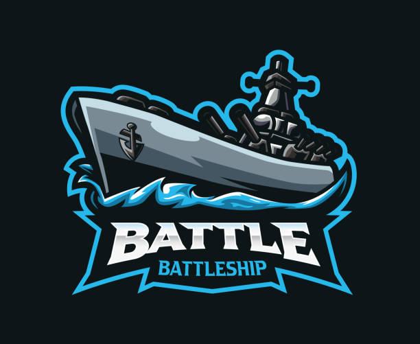
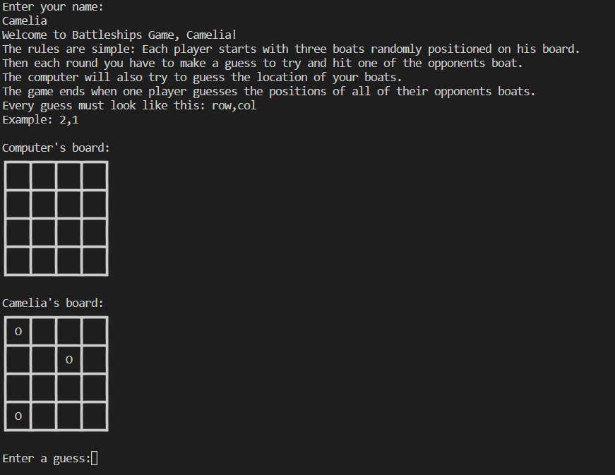

# LEGEND OF THE SEAS

Legend of the seas is a Python terminal battleships game, which runs in the Code Institute mock terminal on Heroku.

This is a game where users can try to beat the computer by guessing where the computer has a fleet of ships hidden on a grid. They take turns trying to guess the location of their opponent's ships.

## How to play
Battleship (also known as Battleships or Sea Battle) is a strategy type guessing game for two players, based on the classic pen-and-paper game.

In our game, the player enters their name and two boards are generated: **user's board** and **computer's board**.

Each player starts with three boats randomly positioned on his board.
The player can see where their ships are, indicated by **"O"** sign, but cannot see where the computer's ships are.

Then each round you have to make a guess to try and hit one of the opponents boat.
Guesses are marked on the board with an **"X"**. Hits are indicated by **"*"**.

The computer will also try to guess the location of your boats.

The game ends when one player guesses the positions of all of their opponents boats.

## Features
### Existing Features
- Random board generation: \
Ships are randomly placed on both players
The user cannot see where the computer's ships are on the board

- Play against the computer
- Accepts user input
- Input validation and error checking: \
*Please enter two numbers separated by a comma* \
*You already guessed this position. Try another one:* \
*Enter a position inside the board*

- Data maintained in class instances
- Game board drawn using unicode characters
- Keep track of correct and wrong guesses
- Show the winner

### Future Features
- Allow player to select the board size and number of ships
- Allow player to position ships themselves
- Allow ships of different sizes

## Data Model
I decided to use a GameBoard class and a BattleshipsGame class as my model. 

The GameBoard class has methods to keep track of the board state, guesses, boat positions, to pretty print the board and to validate a position.

The BattleshipsGame class contains methods for running the game, getting the user input and keeping track of the rounds.
The class creates two instances of the GameBoard class for each round: one for the player and one for the computer.

## Testing

Manually tested by doing the following:
- Given invalid inputs for the user's name: empty string or string of whitespaces.
- Given invalid inputs for the user's guess: text instead of numbers, more than two numbers, negative numbers, numbers outside of the board, same guess twice in a round
- Test that the computer does not guess the same position twice
- Test that both players can win
- Passed the code through a PEP8 linter and confirmed there are no problems.
- Tested in my local terminal and the Code Institute Heroku terminal.

### Bugs
Fixed Bugs:
- User was able to enter an empty name or a name with only whitespaces => I fixed it by stripping the name and checking that the result is not an empty string.
- User was able to use the same guess multiple times => I fixed the bug by remembering every guess and validating that the new guess was unique.
- Multiple boards printed => I fixed it by refactoring the main game loop to only show the boards when necessary.

### Remaining Bugs
- No remaining bugs.

### Validator Testing
- PEP8:
No errors were returned from [PEP8](https://pep8ci.herokuapp.com/)

## Deployment
This project was deployed using Code Institute's mock terminal for Heroku.
Steps for deployment:
- Clone this repository
- Create a new Heroku app
- Set the buildbacks to Python and Node.js in that order
- Link the Heroku app to the repository
- Click on Deploy

## Credits
### Content
- Code Institute for the deployment terminal.
- [The Spruce Crafts](https://www.thesprucecrafts.com/the-basic-rules-of-battleship-411069) for the details of the Battleships game.
- [W3Schools](https://www.w3schools.com) and [GeeksforGeeks](https://www.geeksforgeeks.org) for Python documentation.

### Media
- [istock](https://www.istockphoto.com)
- [Unicode](https://old.unicode-table.com/en/blocks/box-drawing/)
